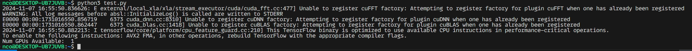
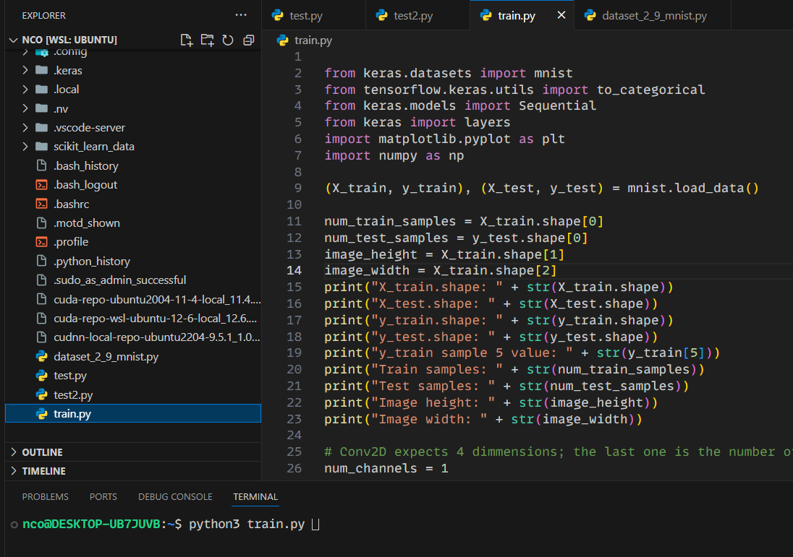
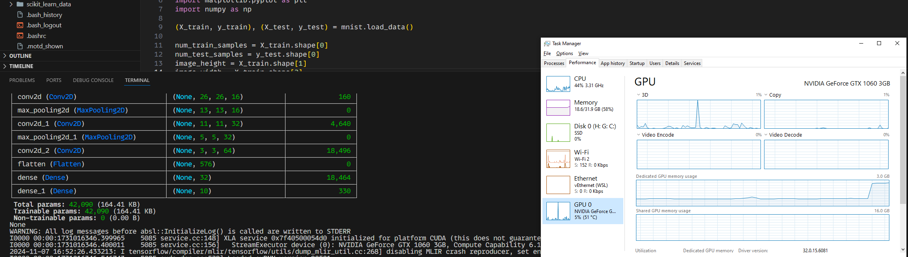
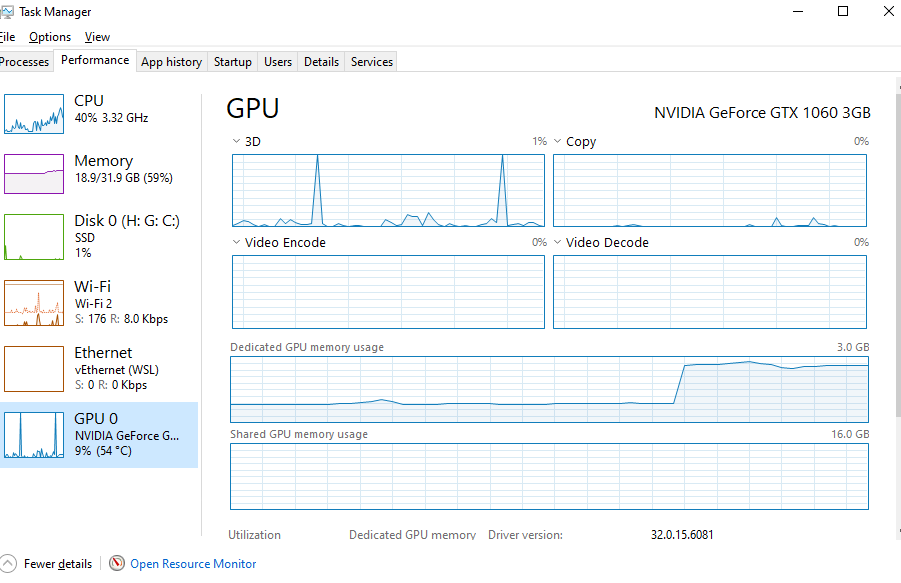
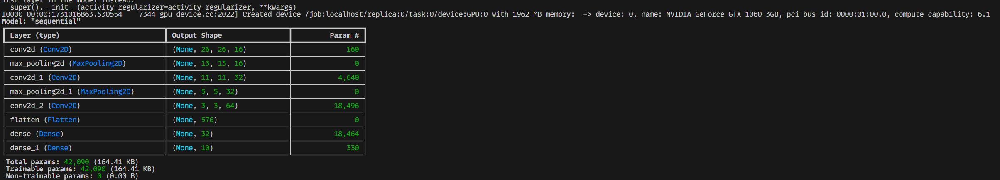
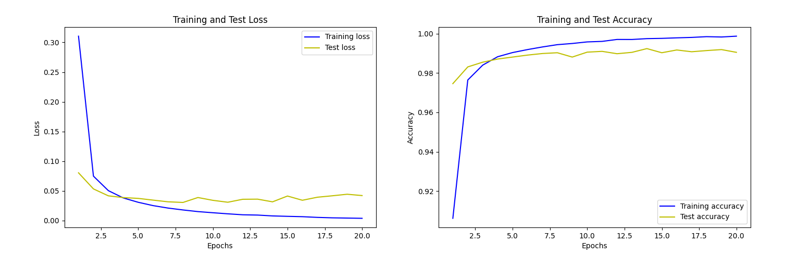
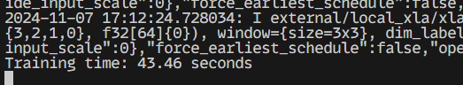
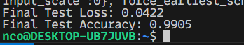
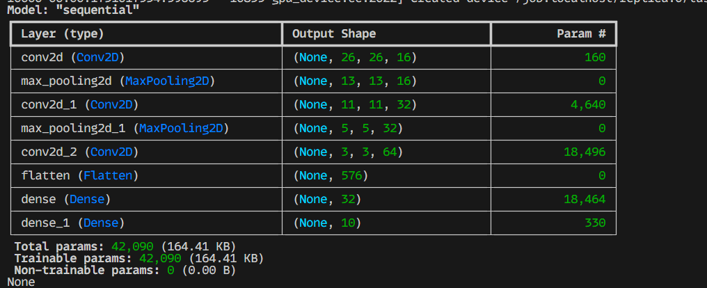

# Report on the implementation of the project
Here is the report on the implementation of the project. The project is about the implementation of the deep learning model using the tensorflow library and testing the enviroment setup

## Enviroment used for the project
- Windows 10
- Nvidia GeForce GTX 1060 3GB
- WSL2
- Ubuntu 22.04 
- Ryzen 5 2400G
- 32GB RAM DDR4 3200MHz

## Validation of tensorflow using gpu

```python
import tensorflow as tf

print("Num GPUs Available: ", len(tf.config.list_physical_devices('GPU')))
```

The output of the above code is:

```
Num GPUs Available:  1
```



## Training the model (dl_ex_1)














## Stats 
- Training time: 43.46s



- Final Test Accuracy: 0.9905
- Final Test Loss: 0.0422




## Additional
