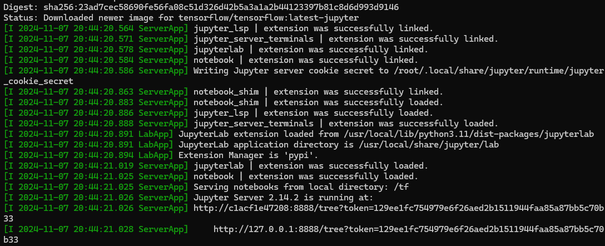

# Setting up the environment

## Installing Python
Download python from [here](https://www.python.org/downloads/)
After downloading, run the installer and make sure to check the box that says "Add Python to PATH"

## Install docker
Download docker from [here](https://www.docker.com/products/docker-desktop)

## Install Jupyter Notebook container
follow the instructions [here](https://www.tensorflow.org/install)


or simply run the following commands in your terminal:
```bash
 docker pull tensorflow/tensorflow:latest  # Download latest stable image
 docker run -it -p 8888:8888 tensorflow/tensorflow:latest-jupyter  # Start Jupyter server 
```

then, open your browser with the token provided in the terminal:




The token is the string after the `?token=` in the URL. In this case, the token is `129ee1fc754979e6f26aed2b1511944faa85a87bb5c70b33`, or simply click on the link provided in the terminal (ctrl+click) to open the browser with the token.

```bash
[I 2024-11-07 20:44:21.028 ServerApp]     http://127.0.0.1:8888/tree?token=129ee1fc754979e6f26aed2b1511944faa85a87bb5c70b33
```


docker run --gpus all -it --rm tensorflow/tensorflow:latest-gpu   python -c "import tensorflow as tf; print(tf.reduce_sum(tf.random.normal([1000, 1000])))"


## References
- [Install nvidia cuda tensorflow on windows wsl2](https://pradeepl.com/blog/installing-nvidia-cuda-tensorflow-on-windows-wsl2/)

- [Download Installer for Linux WSL-Ubuntu 2.0 x86_64](https://developer.nvidia.com/cuda-downloads?target_os=Linux&target_arch=x86_64&Distribution=WSL-Ubuntu&target_version=2.0&target_type=deb_local)

